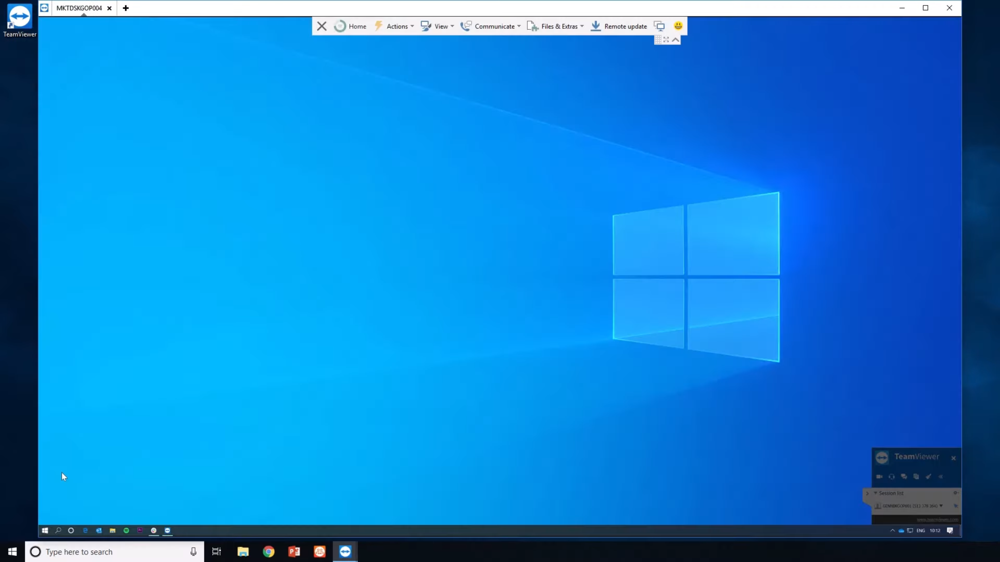

# 如何远程连接服务器进行高性能运算
在科研学习中，个人计算机的算力通常是不太够的，因此学校或者老师会为学生们提供高性能的计算服务器。如何高效利用好这些价格不菲的服务器来帮助自己完成科研和项目任务是值得每一个有志青年好好学习的。如果您只想快速使用服务器完成任务，请直接跳到[使用VS Code搭建简易可用环境](#使用vs-code搭建简易可用环境)。

 ## 远程连接服务器的一些方式
远程操作在计算世界中变得越来越重要，因为它允许用户访问和管理位于世界任何地方的系统。远程操作有两种主要方法：基于命令行界面（Command Line Interface, CLI）和基于图形用户界面（Graphics User Interface， GUI）。这两种方法都有各自的优点和缺点，这取决于用户的需求和正在执行的任务。

### 基于命令行界面的方法

基于命令行界面的远程操作，涉及使用基于文本的命令与远程系统交互。用户将命令直接输入到终端或控制台，然后终端或控制台与远程机器通信以执行任务。一些流行的基于终端的远程操作工具包括：  
1. Secure Shell (SSH)：一种广泛使用的协议，用于对基于Unix的系统进行安全远程访问，也可通过PuTTY或Windows Subsystem for Linux（WSL）等工具在Windows上使用。
2. Telnet：一种较旧的、不太安全的远程访问协议，由于安全问题，主要被SSH取代。
3. PowerShell Remoting：一种Microsoft技术，可通过PowerShell会话对Windows系统进行远程管理。

### 基于图形用户界面的方法

使用图形用户界面的方法能够为用户提供常用的用户操作界面，从而使得用户能够如同操作本地电脑一般操作远程服务器。通过将远程服务器的图形传送到本地计算机，从而获得了相同的用户操作界面。然而现代计算机中的图形渲染频率多为1920\*1080@60fps，这意味着从服务器到本地端需要每秒传送60张1920\*1080的图片，这对网络带宽的要求无疑是巨大的。

一些常用的基于GUI的远程操作方式：
1. [Remote Desktop Protocol (RDP)](https://wiki.archlinux.org/title/List_of_applications/Internet#Remote_desktop)： 一种Microsoft协议，允许用户远程连接和控制基于Windows的系统。
2. [Virtual Network Computing (VNC)](https://en.wikipedia.org/wiki/Virtual_Network_Computing)： 用于远程桌面访问的独立于平台的协议，支持Windows、macOS和Linux等各种操作系统。
3. [TeamViewer](https://www.teamviewer.com/)：一个多功能的远程访问和支持工具，兼容多个平台，包括桌面和移动设备。

如果您想要了解更多此方面的内容，请移步[Remote Desktop](https://wiki.archlinux.org/title/List_of_applications/Internet#Remote_desktop), [Virtual Network Computing](https://en.wikipedia.org/wiki/Virtual_Network_Computing), [Remote Desktop Protocol](https://en.wikipedia.org/wiki/Remote_Desktop_Protocol)。

### 为何使用SSH进行连接
与基于图形用户界面的的解决方案相比，SSH需要更少的带宽和系统资源。并且它能够提供更大的控制和灵活性，特别是对于高级用户和管理员。由于专注于基于文本的通信和较小的攻击面，这种操作方式也更加安全并便于管理。

SSH具有稍微陡峭的学习曲线，因为用户必须熟悉命令行语法和特定于远程系统的命令，同时也不太适合需要图形界面的应用程序。但是现在的一些应用程序也能够很好地帮助大家缓解这一情况。VSCode提供了一整套远程使用环境的解决方案，我们会在下文中详细介绍。

由于计算资源和带宽这一公共资源有限，大多数算力提供平台只提供SSH方式进行操作。一些云服务商也会将某些应用包装之后部署到网页上（例如[Google Colab](https://colab.research.google.com/)），但这种方法限制了用户更多的控制和灵活性。

## 使用VS Code搭建简易可用环境

在进行下一步之前，请确认您已满足以下条件：
1.  可以访问远程服务器的SSH账号（您自己的或由托管服务提供的服务器）
2.  本地机器上安装的[VS Code编辑器](https://code.visualstudio.com/)

### 安装VS Code远程插件

VS Code提供了一款插件[Remote - SSH](https://marketplace.visualstudio.com/items?itemName=ms-vscode-remote.remote-ssh)，能够使得所有操作在远程服务器上得到执行。您需要安装这款插件来远程操作服务器。虽然VS Code提供了操作界面，但是其中的操作命令还是使用文本通过SSH进行传输。

### 使用VS Code连接远程服务器

如果您有一个简单的SSH主机设置，请按如下方式连接到它：

1. 按F1或点击左下角按钮，并运行`Remote-SSH: Open SSH Host...`命令并进行相关设置
2. 在出现的输入框中以以下格式输入用户和主机/IP: `user@host-or-ip`
3. 如果出现提示，请输入您的密码
4. 连接后，使用`File > Open Folder `打开远程主机上的文件夹。

此后您的所有操作都会在远程服务器上执行，而不是在本地机器上。

### 使用VS Code进行远程开发

一旦您打开过一次远程服务器，那么VS Code会记录您之前的访问，之后便可以在侧边栏中进行快速访问。

之后您可以安装不同的插件来进行不同语言的编程。以Pytho为例，首先您需要在服务器上使用命令行安装好Python。使用命令行安装Python的教程，您可以参考[Miniconda安装](https://conda.io/projects/conda/en/stable/user-guide/install/linux.html)。之后您需要在VS Code上安装[Python插件](https://marketplace.visualstudio.com/items?itemName=ms-python.python)，此时插件会安装在远程服务器上而不是在本地机器上。Python插件提供了Jupyter支持，使您能够使用`.ipynb`文件来进行交互式编程。

## 后续
如果想要更加深入地学习SSH的使用方法，您可以参考以下教程:  
1. [阮一峰的《SSH教程》](https://wangdoc.com/ssh/)
2. [SSH官方手册](https://www.openssh.com/manual.html)